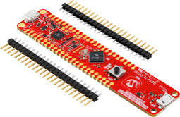

.. zephyr:board:: pic32cm_ls00_cnano

Overview
********

The PIC32CM LS00 Curiosity Nano evaluation kit is a hardware platform to evaluate the
Microchip PIC32CM LS00 microcontrollers, and the evaluation kit part number is EV41C56A.
This kit provides a comprehensive set of features that allow users to explore the PIC32CM
LS00 peripherals and gain insight into integrating the device into their own designs.

   PIC32CM LS00 Curiosity Nano Evaluation Kit

Hardware
********

- 48-pin VQFN/TQFP PIC32CM5164LS00048 microcontroller
- Arm® Cortex®-M23 Microcontroller running at up to 48 MHz (2.64 CoreMark/MHz, single-cycle multiplier, hardware divider)
- Arm TrustZone® for ARMv8-M Security Extensions
- 512 KiB flash memory, 16 KiB Data Flash (WWR), and 64 KiB of SRAM (with ECC support)
- 512 bytes TrustRAM with physical anti-tamper active shield
- One user LED (Yellow LED0 on PA15)
- One green board power/status LED
- One mechanical user push button (SW0 on PA23)
- One reset push button
- Integrated Internal Temperature Sensor
- On-board Nano Debugger (nEDBG / CMSIS-DAP)
- Virtual COM port (CDC UART via SERCOM0)
- Target USB interface (Full-Speed Device and Host)
- Adjustable target voltage regulator (MIC5353, 1.7V to 3.6V, 500 mA max)
- Curiosity Nano edge connectors for breadboard and Curiosity Nano Base

Clock Management
================

- Flexible clock distribution optimized for low power
- 32.768 kHz crystal oscillator (XOSC32K)
- 32.768 kHz ultra low-power internal RC oscillator (OSCULP32K)
- 0.4 to 32 MHz crystal oscillator (XOSC)
- 16/12/8/4 MHz low-power internal RC oscillator (OSC16M)
- 48 MHz digital Frequency-Locked Loop (DFLL48M)
- 32 MHz Ultra low-power digital Frequency-Locked Loop (DFLLULP)
- 32-96 MHz fractional digital Phase-Locked Loop (FDPLL96M)
- Clock Failure Detection on both crystal oscillators (CFD)
- One frequency meter (FREQM)

Input/Output (I/O) & Logic
==========================

- Up to 38 programmable I/O lines on the 48-pin package (PORTA, PORTB)
- Up to 14 external interrupts (EIC) on 48-pin package (up to 16 on family)
- One non-maskable interrupt (NMI)
- Up to Four-LUTs Configurable Custom Logic (CCL) that supports:
  - Combinatorial logic functions (AND, NAND, OR, NOR, XOR, XNOR)
  - Sequential logic functions (Flip-Flop and Latches)
  - Edge detectors and truth tables
- Flexible PORT pin multiplexing (PMUX) for peripherals and routing

Supported Features
==================

.. zephyr:board-supported-hw::

Connections and IOs
===================

The `PIC32CM LE00/LS00/LS60 Curiosity Nano User Guide`_ and `PIC32CM LE00/LS00/LS60 Family Data Sheet`_ have detailed information about board connections.

Programming & Debugging
***********************

.. zephyr:board-supported-runners::

Flash Using Embedded Debugger (EDBG / nEDBG)
============================================

To flash the board using the on-board Embedded Debugger (nEDBG / CMSIS-DAP), follow the steps below:

1. Install Debugger Software (EDBG / PyOCD)

   - Install PyOCD or the EDBG CLI utility:

     .. code-block:: console

        # PyOCD (Default CMSIS-DAP runner in Zephyr)
        pip install pyocd
        pyocd pack update
        pyocd pack install pic32cm

        # Or build EDBG tool (Alex Taradov EDBG CLI tool)
        sudo apt-get install libudev-dev
        git clone https://github.com/ataradov/edbg.git && cd edbg && make
        sudo cp edbg /usr/local/bin/

2. Connect the Board

   - Connect the **DEBUG USB** port on the board to your host machine via USB.
   - This connection powers up the board and provides direct access to the on-board **nEDBG** debugger.

3. Build the Application

   You can build a sample Zephyr application, such as **Blinky**, using the ``west`` tool.
   Run the following commands from your Zephyr workspace:

   .. code-block:: console

      west build -b pic32cm_ls00_cnano -p -s samples/basic/blinky

   This will build the Blinky application for the ``pic32cm_ls00_cnano`` board.

4. Flash the Device

   Once the build completes, flash the firmware using:

   .. code-block:: console

      west flash

   Alternatively, to flash directly using the EDBG CLI tool:

   .. code-block:: console

      edbg -b -t pic32cm5164ls00048 -pv -f build/zephyr/zephyr.bin

5. Observe the Result

   After flashing, **LED0 (PA15)** on the board should start **blinking**, indicating that the
   application is running successfully.

Debug Using Embedded Debugger: GDB Command-Line
===============================================

To debug the board using PyOCD / GDB, run the following command from your Zephyr workspace:

.. code-block:: console

   west debug

.. note::
   Debugging with GDB Server: Halting at `main` and Setting Breakpoints

   .. code-block:: sh

      (gdb) break main
      (gdb) break main.c:42         # Optional: set breakpoint at line 42 in main.c
      (gdb) continue                # Start execution, halts at first breakpoint
      (gdb) info breakpoints        # List all breakpoints
      (gdb) delete 1                # Delete breakpoint number 1
      (gdb) delete                  # Delete all breakpoints
      (gdb) clear main.c:42         # Clear breakpoint at specific location
      (gdb) continue                # Resume execution

Debug Using Embedded Debugger: VSCode
=====================================

To debug using VSCode, create or edit the **.vscode/launch.json** file in your project directory with the following configuration:

.. code-block:: json

   {
      "version": "0.2.0",
      "configurations": [
         {
            "name": "Debug (EDBG / PyOCD, PIC32CM5164LS00048)",
            "type": "cortex-debug",
            "request": "launch",
            "servertype": "pyocd",
            "device": "PIC32CM5164LS00048",
            "targetId": "pic32cm5164ls00048",
            "interface": "swd",
            "runToEntryPoint": "main",
            "showDevDebugOutput": "none",
            "cwd": "${workspaceFolder}",
            "executable": "${workspaceFolder}/build/zephyr/zephyr.elf",
            "serverpath": "pyocd",
            "serverArgs": [
               "gdbserver",
               "--frequency=4000000",
               "--target=pic32cm5164ls00048",
               "--port=3333"
            ]
         }
      ]
   }

References
**********

PIC32CM LS00 Product Page:
   https://www.microchip.com/en-us/product/pic32cm5164ls00048

PIC32CM LE00/LS00/LS60 Family Data Sheet (DS60001615):
   https://ww1.microchip.com/downloads/aemDocuments/documents/MCU32/ProductDocuments/DataSheets/PIC32CM-LE00-LS00-LS60-Family-Data-Sheet-DS60001615.pdf

PIC32CM LS00 Curiosity Nano evaluation kit Page (EV41C56A):
   https://www.microchip.com/en-us/development-tool/EV41C56A

Zephyr GitHub Issue #116364:
   https://github.com/zephyrproject-rtos/zephyr/issues/116364

Zephyr Microchip Architecture RFC #92168:
   https://github.com/zephyrproject-rtos/zephyr/issues/92168

.. _PIC32CM LE00/LS00/LS60 Curiosity Nano User Guide:
   https://ww1.microchip.com/downloads/aemDocuments/documents/MCU32/ProductDocuments/UserGuides/PIC32CM-LE00-LS00-LS60-Curiosity-Nano-User-Guide-DS50003000.pdf

.. _PIC32CM LE00/LS00/LS60 Family Data Sheet:
   https://ww1.microchip.com/downloads/aemDocuments/documents/MCU32/ProductDocuments/DataSheets/PIC32CM-LE00-LS00-LS60-Family-Data-Sheet-DS60001615.pdf

SoC Architecture Guide: PIC32CM5164LS00048
******************************************

1. SoC Overview & Purpose
=========================
Focuses on the silicon layer of the ``pic32cm5164ls00048`` (Arm Cortex-M23 with TrustZone-M), defining core memory maps, clocks, and power controls distinct from board-level wiring.

2. SoC Directory Structure
==========================

.. code-block:: text

   soc/microchip/pic32c/pic32cm_ls/
   ├── common/
   │   ├── dts/                 ← DeviceTree include headers
   │   ├── pinctrl_soc.h        ← Port G1 pinmux macros
   │   ├── soc.c                ← FDPLL96M 48MHz clock init & SRAM zeroing
   │   └── CMakeLists.txt       ← Build logic for common files
   │
   └── pic32cm_ls00/
       ├── CMakeLists.txt       ← Subdirectory build hooks
       ├── Kconfig              ← Series Kconfig symbols
       ├── Kconfig.defconfig    ← Hardware defaults (M23, MPU, NUM_IRQS=136)
       ├── Kconfig.soc          ← Declares SOC_SERIES_PIC32CM_LS00
       └── soc.yml              ← Metadata registry for Zephyr

3. Memory Mapping
=================
- **Flash (512 KB):** ``0x00000000`` to ``0x00080000`` (Linker code, vector table, .rodata)
- **SRAM (64 KB):** ``0x20000000`` to ``0x20010000`` (Kernel stacks, thread control blocks, heap, .data/.bss)

4. Clock Initialization
=======================

.. code-block:: text

   OSC16M (16 MHz) ──► GCLK1 (/16) ──► 1.0 MHz ──► FDPLL96M (LDR=47) ──► 48 MHz ──► GCLK0 ──► CPU

- Flash wait states configured to 2 (``NVMCTRL_CTRLB.RWS = 2``)
- Power Manager switched to Performance Level 2 (``PM_PLCFG = PL2``)
- GCLK1 divides 16 MHz OSC16M by 16 to produce 1.0 MHz reference
- FDPLL96M multiplies reference to 48.0 MHz and drives main GCLK0

5. soc_reset_hook()
===================

.. code-block:: text

   SRAM Zeroing (0x20000000 - 0x20010000) ──► pic32cm_ls_clock_init() ──► 48 MHz PL2 ──► Zephyr Init

Thumb assembly clears the full 64 KB SRAM range to eliminate false ECC parity traps upon cold boot.

6. Peripheral Mapping
=====================
- **NVMCTRL:** ``0x41004000``
- **Power/Clock (MCLK):** ``0x40000800``
- **GCLK:** ``0x40001C00``
- **OSCCTRL:** ``0x40001000``
- **PORTA:** ``0x40003000``
- **PORTB:** ``0x40003080``

*Represented strictly through Devicetree rather than hardcoded in drivers.*

7. ARM TrustZone-M
==================
- Implements ARMv8-M security attribution (Secure vs Non-Secure).
- Peripherals attributed through PAC registers.
- Recommended phrasing: *"During bring-up, I had to distinguish clock-access problems from Secure/Non-Secure peripheral-access problems."*

8. 60-Second Meeting Summary
============================
*"We structured the PIC32CM5164LS00048 SoC following RFC #92168 using GC00/SG00 as references, mapped 512KB Flash and 64KB SRAM, zero-initialized SRAM in soc_reset_hook() for ECC safety, configured FDPLL96M at 48MHz under PL2 in soc.c, mapped all APB peripherals via Devicetree, and verified TrustZone-M security access."*

dts/arm/microchip (SoC Hardware Devicetree Architecture)
********************************************************

1. Purpose of the dts/arm/microchip/ Layer
==========================================
- **Silicon Hardware Topology:** Contains the Devicetree Include files (``.dtsi``) describing what physical hardware exists on Microchip Arm Cortex microcontrollers in the upstream Zephyr hardware tree.
- **Separation of Concerns:**
  - **``dts/arm/microchip/`` (SoC Silicon):** Defines physical silicon features (CPU core, MPU, memory boundaries, peripheral register base addresses).
  - **``boards/`` (Board Wiring):** Defines physical PCB pin wiring, enabled peripheral switches, and active oscillators.
  - **``dts/bindings/`` (YAML Schema):** Defines compile-time rules and validation schemas for peripheral properties.
- **One-Liner to Memorize:** *"The dts/arm/microchip/ files define the complete silicon hardware blueprint of what exists inside the chip packaging."*

2. The 7 PIC32C Families in dts/arm/microchip/pic32c/
=====================================================
Inside ``zephyr/dts/arm/microchip/pic32c/``, there are exactly 7 microcontroller families:

.. code-block:: text

   sujan@sujan-Victus:~/zephyrproject/zephyr/dts/arm/microchip/pic32c$ ls -l
   total 28
   drwxrwxr-x 5 sujan sujan 4096 Aug  9 17:33 pic32ck_sg_gc  ← PIC32CK SG/GC (Arm Cortex-M33)
   drwxrwxr-x 5 sujan sujan 4096 Aug  9 17:33 pic32cm_jh     ← PIC32CM JH (Arm Cortex-M0+)
   drwxrwxr-x 4 sujan sujan 4096 Aug 11 16:16 pic32cm_ls     ← PIC32CM LS (Arm Cortex-M23) [OUR PORT]
   drwxrwxr-x 4 sujan sujan 4096 Aug  9 17:33 pic32cm_pl     ← PIC32CM PL (Arm Cortex-M0+)
   drwxrwxr-x 5 sujan sujan 4096 Aug  9 17:33 pic32cm_sg_gc  ← PIC32CM SG/GC (Arm Cortex-M0+)
   drwxrwxr-x 6 sujan sujan 4096 Aug  9 17:33 pic32cx_sg     ← PIC32CX SG (Arm Cortex-M4F)
   drwxrwxr-x 6 sujan sujan 4096 Aug  9 17:33 pic32cz_ca     ← PIC32CZ CA (Arm Cortex-M7)

3. Internal Directory Structure of pic32cm_ls/
==============================================
.. code-block:: text

   dts/arm/microchip/pic32c/pic32cm_ls/
   ├── common/
   │   ├── pic32cm_ls.dtsi          ← Root SoC architecture (CPU, MPU, SRAM0, Port G1, NVIC)
   │   ├── pic32cm_ls_48.dtsi       ← Package-level peripheral layout for 48-pin variant
   │   └── pic32cm_5164_ls.dtsi     ← Memory partition (512KB Flash @ 0x0, 64KB SRAM @ 0x20000000)
   └── pic32cm_ls00/
       └── pic32cm5164ls00048.dtsi  ← Top-level chip DTSI pulling together memory & package

4. File-by-File Technical Breakdown
===================================
- **``common/pic32cm_ls.dtsi`` (Root SoC Node):**
  - Includes ``<arm/armv8-m.dtsi>`` and ``<zephyr/dt-bindings/gpio/gpio.h>``.
  - Declares ``cpu0: cpu@0`` (``arm,cortex-m23``) and ARMv8-M MPU (``0xe000ed90``).
  - Declares SRAM0 base (``0x20000000``).
  - Instantiates Port G1 pinmux controller ``pinctrl@40003200`` with child GPIO banks ``porta`` and ``portb``.
  - Configures NVIC priority bits: ``&nvic { arm,num-irq-priority-bits = <2>; };``.
- **``common/pic32cm_ls_48.dtsi`` (Package Include):**
  - Represents the physical 48-pin package layout, exposing only PORTA and PORTB to board DTS.
- **``common/pic32cm_5164_ls.dtsi`` (Memory Include):**
  - Sets physical memory limits: 512 KiB Flash (``DT_SIZE_K(512)``) and 64 KiB SRAM (``DT_SIZE_K(64)``).
- **``pic32cm_ls00/pic32cm5164ls00048.dtsi`` (Chip Top-Level):**
  - Top-level part-number file included directly by board Devicetree files (``pic32cm_ls00_cnano.dts``).

5. Devicetree Inclusion Hierarchy Chain
=======================================
.. code-block:: text

   Board Devicetree (pic32cm_ls00_cnano.dts)
      ↓ Includes: #include <microchip/pic32c/pic32cm_ls/pic32cm_ls00/pic32cm5164ls00048.dtsi>
   SoC Top-Level DTSI (pic32cm5164ls00048.dtsi)
      ├── Includes: pic32cm_5164_ls.dtsi (Sets 512KB Flash & 64KB SRAM)
      └── Includes: pic32cm_ls_48.dtsi (48-pin package)
             ↓ Includes: pic32cm_ls.dtsi (Root SoC definition)
                    ↓ Includes: <arm/armv8-m.dtsi> (Arm Cortex-M Architecture)

6. Memory Sizing & Linker Integration
=====================================
- **Flash Mapping:** ``reg = <0x00000000 DT_SIZE_K(512)>`` (Vector table, kernel code, application code).
- **SRAM Mapping:** ``reg = <0x20000000 DT_SIZE_K(64)>`` (Stacks, thread control blocks, data/bss segments).
- **Linker Script Generation:** Zephyr automatically constructs linker memory regions directly from Devicetree.

7. Port G1 GPIO & Pin Controller Mapping
========================================
- **Hierarchical Node Architecture:** ``pinctrl: pinctrl@40003200`` with child nodes ``porta: gpio@40003200`` and ``portb: gpio@40003280``.
- **Decoupled Functionality:** Pin multiplexer (``microchip,port-g1-pinctrl``) manages peripheral pin muxing while child GPIO controllers manage standard digital input/output operations.

8. What We Wrote & Implemented
==============================
- Created the dedicated ``dts/arm/microchip/pic32c/pic32cm_ls/`` tree following upstream conventions.
- Configured 512KB Flash and 64KB SRAM for ``pic32cm5164ls00048``.
- Validated all peripheral base addresses against the Microchip PIC32CM LS00 Family Datasheet (DS60001615).

9. Review / Viva Speaking Script
================================
*"We structured our SoC Devicetree in dts/arm/microchip/pic32c/pic32cm_ls/ across modular DTSI files. The root pic32cm_ls.dtsi defines the Arm Cortex-M23 CPU, MPU, NVIC, and Port G1 pin controller. Package includes (pic32cm_ls_48.dtsi) and memory includes (pic32cm_5164_ls.dtsi with 512KB Flash and 64KB SRAM) are assembled into the top-level pic32cm5164ls00048.dtsi, allowing clean reuse across different pinout and memory variants."*

dts/bindings & dt-bindings (Schemas & Header Constants)
*******************************************************

1. Purpose of dts/bindings/ and dt-bindings/
============================================
- **The Devicetree Triad:**
  - **1. ``dts/arm/microchip/`` (Hardware Topology):** Declares node existence, base addresses (``0x40003000``), and IRQs (``<65 0>``).
  - **2. ``dts/bindings/`` (YAML Schemas):** Enforces property types, mandatory fields, and cell count validation rules at compile time.
  - **3. ``include/zephyr/dt-bindings/`` (Shared Header Constants):** Supplies preprocessor constants (``GPIO_ACTIVE_LOW``, ``GPIO_PULL_UP``) shared between DTS and C drivers.
- **One-Liner to Memorize:** *"YAML bindings in dts/bindings/ are the rulebook that validates hardware nodes, while headers in dt-bindings/ provide human-readable flag macros for both DTS files and C driver code."*

2. YAML Bindings & Headers Utilized
===================================
- **GPIO YAML (``dts/bindings/gpio/atmel,sam0-gpio.yaml``):** Defines ``#gpio-cells: 2`` (pin number + flags).
- **UART YAML (``dts/bindings/serial/atmel,sam0-uart.yaml``):** Validates SERCOM baud rate, NVIC interrupts, and pinout modes (``rxpo``, ``txpo``).
- **LED & Key Bindings:** ``gpio-leds.yaml`` (User LED0 on PA15) and ``gpio-keys.yaml`` (User Button SW0 on PA23).
- **Header Constants (``include/zephyr/dt-bindings/gpio/gpio.h``):** Defines ``GPIO_ACTIVE_LOW (1 << 0)``, ``GPIO_PULL_UP (1 << 4)``.

modules/hal/microchip/packs/ (HAL / DFP Packs Architecture)
***********************************************************

1. Purpose of the modules/hal/microchip/packs/ Layer
====================================================
- **CMSIS Register Foundation:** Official Microchip Device Family Pack (DFP) containing hardware register typedef structures (``PortGroup``, ``SercomUsart``), bitmask macros, and CMSIS core interfaces.
- **Role in Zephyr:** SoC startup code (``soc.c``) and drivers (``gpio_sam0.c``, ``uart_sam0.c``) include these headers (via ``<pic32c.h>``) to access hardware registers via typed C structs instead of hardcoded hex pointers.
- **One-Liner to Memorize:** *"The HAL DFP pack provides the official vendor C structs and bitmask macros that turn raw silicon hex addresses into strongly-typed C pointers for Zephyr SoC boot code and drivers."*

2. The 7 PIC32C Families in modules/hal/microchip/packs/pic32c/
===============================================================
.. code-block:: text

   sujan@sujan-Victus:~/zephyrproject/modules/hal/microchip/packs/pic32c$ ls -la
   total 40
   drwxrwxr-x 9 sujan sujan 4096 Aug 12 22:48 .
   drwxrwxr-x 4 sujan sujan 4096 Jul 16 15:52 ..
   -rw-rw-r-- 1 sujan sujan  630 Aug 12 17:51 CMakeLists.txt
   drwxrwxr-x 4 sujan sujan 4096 Jul 16 15:52 pic32ck_sg_gc  ← PIC32CK SG/GC (Arm Cortex-M33)
   drwxrwxr-x 5 sujan sujan 4096 Jul 16 15:52 pic32cm_jh     ← PIC32CM JH (Arm Cortex-M0+)
   drwxrwxr-x 3 sujan sujan 4096 Aug 10 11:32 pic32cm_ls     ← PIC32CM LS (Arm Cortex-M23) [OUR ADDED PACK ⭐]
   drwxrwxr-x 4 sujan sujan 4096 Jul 16 15:52 pic32cm_pl     ← PIC32CM PL (Arm Cortex-M0+)
   drwxrwxr-x 4 sujan sujan 4096 Jul 16 15:52 pic32cm_sg_gc  ← PIC32CM SG/GC (Arm Cortex-M0+)
   drwxrwxr-x 6 sujan sujan 4096 Jul 16 15:52 pic32cx_sg     ← PIC32CX SG (Arm Cortex-M4F)
   drwxrwxr-x 7 sujan sujan 4096 Jul 16 15:52 pic32cz_ca     ← PIC32CZ CA (Arm Cortex-M7)

3. Internal Structure of pic32cm_ls00/include/
==============================================
.. code-block:: text

   sujan@sujan-Victus:~/zephyrproject/modules/hal/microchip/packs/pic32c/pic32cm_ls/pic32cm_ls00/include$ ls -l
   total 88
   drwxrwxr-x 2 sujan sujan  4096 Aug 18 09:36 component             ← 34 peripheral register typedef structs (port.h, sercom.h)
   -rw-r--r-- 1 sujan sujan  1694 Aug 18 09:36 component-version.h   ← DFP component version identifier
   drwxrwxr-x 2 sujan sujan  4096 Aug 18 09:36 instance              ← 42 instance base definitions (port.h, sercom0.h)
   -rw-r--r-- 1 sujan sujan  1755 Aug 18 09:36 pic32c.h              ← Top-level device selector dispatch header
   -rw-rw-r-- 1 sujan sujan 64258 Aug 18 09:36 pic32cm5164ls00048.h   ← Complete chip header (IRQn_Type, NVIC bits, memory)
   drwxrwxr-x 2 sujan sujan  4096 Aug 19 20:41 pio                   ← Pinmux & package pin mapping macros
   -rw-r--r-- 1 sujan sujan  1604 Aug 18 09:36 system_pic32cmls00.h  ← CMSIS SystemInit & SystemCoreClock prototypes

4. File & Subfolder Breakdown
=============================
- **``pic32c.h`` (Top-Level Dispatcher):** Universal entry point conditionally routing to ``pic32cm5164ls00048.h``.
- **``pic32cm5164ls00048.h`` (64 KB Chip Header):** Declares Arm Cortex-M23 core parameters (``__NVIC_PRIO_BITS 2U``) and complete 136-entry ``IRQn_Type`` interrupt enumeration.
- **``component/port.h``:** Defines ``port_group_registers_t`` (``PORT_DIR``, ``PORT_DIRSET``, ``PORT_OUTTGL``, ``PORT_IN``).
- **``component/sercom.h``:** Defines ``sercom_usart_registers_t`` (``CTRLA``, ``BAUD``, ``INTFLAG``, ``DATA``).
- **``pio/pic32cm5164ls00048.h``:** Defines physical pin constants (``PIN_PA15``, ``PIN_PA23``) and pin multiplexer bitmasks (``PINMUX_PA15C_SERCOM0_PAD2``).

5. CMake Build Integration
==========================
.. code-block:: cmake

   # In modules/hal/microchip/packs/pic32c/CMakeLists.txt:
   add_subdirectory_ifdef(CONFIG_SOC_SERIES_PIC32CM_LS00 pic32cm_ls/pic32cm_ls00)

   # In modules/hal/microchip/packs/pic32c/pic32cm_ls/pic32cm_ls00/CMakeLists.txt:
   zephyr_include_directories(include)
   zephyr_include_directories(include/pio)
   zephyr_include_directories(include/component)
   zephyr_include_directories(include/instance)

6. Review / Viva Speaking Script
================================
*"The HAL DFP pack in modules/hal/microchip/packs/pic32c/pic32cm_ls/ contains the official vendor register definitions for our PIC32CM LS00 microcontroller. It defines the CMSIS core settings, the complete 136-line interrupt enum table, and the peripheral structs like port_group_registers_t and sercom_usart_registers_t. Zephyr's CMake includes this pack whenever CONFIG_SOC_SERIES_PIC32CM_LS00 is active, allowing both SoC startup code and upstream SAM0 drivers to access hardware registers seamlessly."*

Drivers in Zephyr RTOS (GPIO & UART Architecture)
*************************************************

1. What is a Driver in Zephyr?
==============================
- **Core Definition:** A driver in Zephyr is a C software module that directly controls microcontroller hardware registers and exposes a standard, uniform programmatic API.
- **Hardware Register Abstraction:** Eliminates low-level register manipulation (``PORT_REGS``, ``SERCOM_USART_REGS``) from application code.
- **Standard Subsystem API Structures:**
  - **GPIO Driver API (``struct gpio_driver_api``):** Function pointers for ``.pin_configure``, ``.port_get_raw``, ``.port_set_masked_raw``, ``.port_set_bits_raw``, ``.port_clear_bits_raw``, and ``.port_toggle_bits``.
  - **UART Driver API (``struct uart_driver_api``):** Function pointers for ``.poll_in``, ``.poll_out``, ``.err_check``, and interrupt FIFO operations.
- **Static Compile-Time Instantiation:** Uses ``DEVICE_DT_INST_DEFINE()`` to create ``const struct device`` in Flash ROM at build time (zero heap usage / no ``malloc``).
- **One-Liner to Memorize:** *"Application code never touches hardware registers; it calls the generic Zephyr driver API, and the driver translates that call into microcontroller-specific register operations."*

2. What is the Purpose of Drivers in Zephyr?
============================================
- **Point 1 — Cross-Platform Portability:** Application code (e.g. Blinky, Hello World) is 100% hardware-agnostic; the same C source runs unmodified on STM32, Nordic nRF, ESP32, and PIC32CM.
- **Point 2 — Decoupled Architecture Flow:**
  - Application Layer -> Calls standard generic APIs (``gpio_pin_toggle_dt()``, ``uart_poll_out()``).
  - Zephyr Subsystem API -> Translates generic call into ``dev->api`` function pointer.
  - Hardware Device Driver -> C driver (``gpio_sam0.c``, ``uart_sam0.c``) computes bitmask.
  - Physical Silicon Registers -> Writes hex values to memory-mapped registers (``PORTA.OUTTGL @ 0x4000301C``, ``SERCOM0.DATA @ 0x42000000``).
- **Point 3 — Compile-Time Hardware Safety:** Validates all peripheral properties and pin connections during build via Devicetree, catching errors before flashing.
- **Point 4 — Deterministic Initialization Ordering:** Priority levels (e.g. ``POST_KERNEL``) guarantee system clocks (``FDPLL96M 48MHz``) and power domains are active before peripherals turn on.

3. Which Series We Referred To
==============================
- **Reference 1 — Microchip SAM L10 / SAM L11 (SAM0):** Shares the same Arm Cortex-M23 core with ARMv8-M TrustZone, Port G1 GPIO registers, and SERCOM peripherals.
- **Reference 2 — Microchip PIC32CM GC00 / SG00:** Direct sister family sharing the identical Port G1 GPIO controller (``PORT_REGS``) and SERCOM USART architecture.
- **Reused Driver Files:** ``drivers/gpio/gpio_sam0.c`` (GPIO) and ``drivers/serial/uart_sam0.c`` (SERCOM UART).
- **Why Driver Reuse Was Possible:** Microchip standardizes its Port G1 and SERCOM IP across both SAM0 and PIC32CM microcontrollers; by declaring compatible strings (``"atmel,sam0-gpio"``, ``"atmel,sam0-uart"``), we leveraged upstream-tested driver logic without writing new driver C code from scratch.
- **Review / Viva Script:** *"We did not need to write new GPIO and UART drivers from scratch because Microchip standardized its Port G1 and SERCOM IP across SAM L10/L11 and PIC32CM. We reused Zephyr's upstream-tested gpio_sam0.c and uart_sam0.c, binding them via Devicetree."*

4. Devicetree YAML Bindings (GPIO YAML, UART YAML & Used Bindings)
==================================================================
- **Role of YAML Bindings:** Acts as the formal contract/schema validating properties, types, and cell counts for Devicetree nodes at build time.
- **Point A — GPIO YAML Binding (``dts/bindings/gpio/atmel,sam0-gpio.yaml``):**
  - Compatible: ``"atmel,sam0-gpio"`` / ``"microchip,port-g1-gpio"``.
  - Property: ``gpio-controller;``
  - Cells: ``#gpio-cells: 2`` (pin index 0-31, flags like ``GPIO_ACTIVE_LOW``, ``GPIO_PULL_UP``).
  - Target nodes: ``&porta`` (``0x40003000``) and ``&portb`` (``0x40003080``).
- **Point B — UART (SERCOM) YAML Binding (``dts/bindings/serial/atmel,sam0-uart.yaml``):**
  - Compatible: ``"atmel,sam0-uart"`` / ``"microchip,sercom-uart"``.
  - Base address: ``reg = <0x42000000 0x40>``.
  - Interrupts: ``interrupts = <65 0>, <66 0>, <67 0>, <68 0>`` (RX, TX, ERROR, DRE).
  - Baud rate: ``current-speed = <115200>``.
  - Pin multiplexing: ``rxpo`` (PAD0-PAD3), ``txpo`` (PAD0/PAD2 with RTS/CTS).
  - Target node: ``&sercom0`` for on-board nEDBG Virtual COM port.
- **Point C — Other Used Driver Bindings:**
  - ``dts/bindings/led/gpio-leds.yaml`` -> Yellow User LED0 (PA15, Active-Low).
  - ``dts/bindings/input/gpio-keys.yaml`` -> User Push Button SW0 (PA23, Active-Low with pull-up).

Board Layer Architecture & Implementation Guide
***********************************************

1. Purpose of the Board Layer
=============================
"This section explains the board layer — the files that describe this specific physical board (pin wiring, enabled peripherals, default configuration), sitting above the SoC layer and below the application."

One-liner to memorize:
"The SoC layer says what the chip can do. The board layer says what's actually wired and used on this exact PCB."

2. Full Board Folder Structure
==============================

.. code-block:: text

   boards/microchip/pic32c/pic32cm_ls00_cnano/
   ├── board.cmake                     ← Configures debug/flash runner (PyOCD, OpenOCD, EDBG)
   ├── board.yml                       ← Modern Zephyr v2 board metadata (name, vendor, SoC)
   ├── Kconfig.pic32cm_ls00_cnano      ← Selectable board option symbol, gates SoC dependency
   ├── Kconfig.defconfig               ← Board-specific default Kconfig values (console UART, clocks)
   ├── pic32cm_ls00_cnano_defconfig    ← Baseline .config options applied to every build
   ├── pic32cm_ls00_cnano.dts          ← Target hardware Devicetree (enabled nodes, pinctrl, aliases)
   ├── pic32cm_ls00_cnano.yaml         ← Twister test runner metadata (testing capability flags)
   ├── pinctrl.dtsi                    ← (or inline pinctrl nodes) maps signals to physical pins
   ├── doc/
   │   ├── index.rst                   ← Official Sphinx documentation shown on Zephyr docs site
   │   └── pic32cm_ls00_cnano.png      ← High-resolution board picture
   └── support/                        ← Optional: OpenOCD / J-Link / PyOCD scripts

3. File-by-File Technical Breakdown
===================================
- **``board.cmake``:** Tells Zephyr's build system which debug/flash runner to use (OpenOCD, PyOCD, EDBG, J-Link) and any runner-specific arguments.
- **``board.yml``:** Board metadata under modern Zephyr: board name, vendor, SoC part number it uses, and supported architectures.
- **``Kconfig.board`` / ``Kconfig.<board>``:** Declares the board as a selectable option, gated by which SoC it depends on.
- **``Kconfig.defconfig``:** Board-specific default Kconfig values (console UART, default GPIO, LED/button aliases enabled by default).
- **``<board>_defconfig``:** The actual baseline ``.config`` fragment applied to every build for this board.
- **``<board>.dts``:** The physical hardware description (includes SoC ``.dtsi``, enables specific peripheral nodes, adds pinctrl bindings).
- **``<board>.yaml``:** Twister metadata (supported features, RAM/flash size, testing capability flags).
- **``pinctrl.dtsi`` / pinctrl nodes:** Maps peripheral signals to actual physical pins for this board.
- **``doc/index.rst``:** Human-readable board documentation shown on Zephyr's official documentation website.

4. Board-Level Kconfig Defaults
===============================
"Kconfig.defconfig on the board level is where I set things that are true only because of this board's wiring — not the chip's capability. For example, choosing SERCOM0 as the debug console isn't a chip fact, it's a board fact — SERCOM0 happens to be the one routed to the on-board USB-to-UART bridge on this specific board."

5. Board Revisions & Overlays
=============================
"Zephyr supports board revisions via overlay files (``<board>_<revision>.overlay``), so hardware changes (e.g. rev B moving an LED pin) don't require rewriting or duplicating a whole new board definition."

6. Flashing & Debugging Path
============================
"When I run ``west flash``, ``board.cmake`` tells Zephyr's build system to use PyOCD or OpenOCD targeting the on-board nEDBG debugger — that is what allows ``west flash`` and ``west debug`` to work out-of-the-box without requiring manual debugger flags."

7. What We Actually Implemented
===============================
- Flipped ``&porta``, ``&portb``, and ``&systick`` to ``status = "okay"`` in ``pic32cm_ls00_cnano.dts``.
- Mapped ``led0`` to PA15 (Active-Low) and ``sw0`` to PA23 (Active-Low with pull-up).
- Routed console UART to SERCOM0 (PA22/PA23) for on-board nEDBG CDC UART.
- Added PyOCD and OpenOCD runner definitions in ``board.cmake``.
- Created ``board.yml`` schema v2 metadata.

8. Bring-Up Diagnostic Note
===========================
*"Most board-level bring-up issues showed up as a peripheral working electrically but not functionally — usually a pinctrl mismatch between what I wired in .dts and what was physically connected — rather than SoC-level clock problems, which is what told me to look at the board layer specifically."*

9. Closing Architectural Bridge (SoC + DTS + Boards)
====================================================
"The SoC layer defines chip capability, Devicetree describes hardware topology using that capability, and the board layer decides which parts of that topology are actually present and configured on this specific PCB — three layers, three separate concerns, so the same SoC and driver code can be reused across many different boards."

